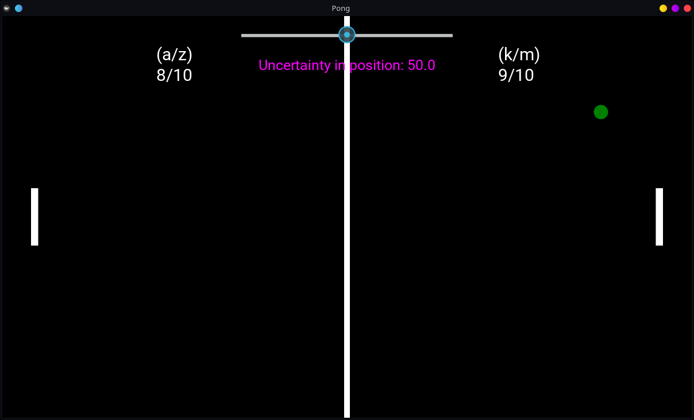

# HeisenPong

Pong, but where the ball moves with a trajectory corresponding to the [Heisenberg Uncertainty Principle](https://en.wikipedia.org/wiki/Uncertainty_principle);

The uncertainty principle states that the more confident we are in a particles position, the less confident we can be in its momentum;


x is position, p is momentum, and the h thing (h-bar) is a fixed, very small, constant.

For any large moving body, e.g. a car, this doesn't matter very much as we can still be confident in the car's position and momentum to within a tiny fraction of their values, so we don't even notice the effect. For much smaller things, e.g. an electron, this is much more important. 

I thought this effect could be explained reasonably well via pong, if it was played on an atomic scale, so hopefully this makes it clearer.


---

### To Play:

player 1 moves paddle up/down with a/z

player 2 moves paddle up/down with k/m

---

requires: python (version 3.6+), Kivy (```pip install kivy```)

### Run with ```python HeisenPong.py```

Enjoy!

---
I used the Kivy example ['Pong'](https://kivy.org/doc/stable/tutorials/pong.html) code as a starting template.
